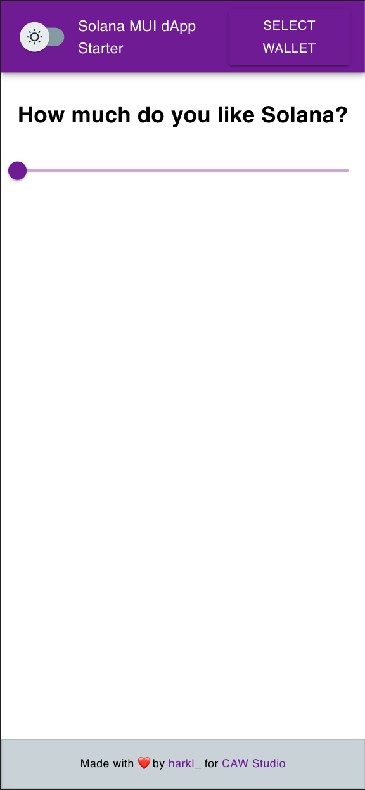
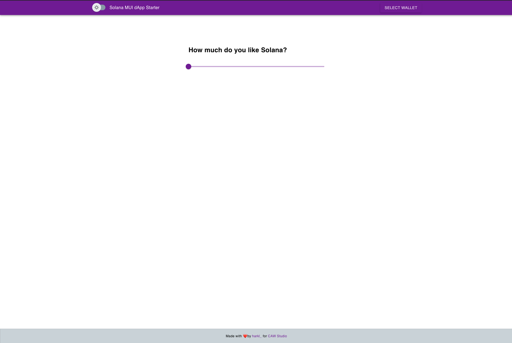

# Solana MUI dApp Scaffold

Welcome to the Solana MUi Dapp Scaffold brougght to you by CAW Studios! This is a React.js project that has been bootstrapped with create-react-app and it is built to be compatible with Solana wallets and wallet adapters. Keep in mind, however, that depending on the plugin and wallet compatibility, the responsive version for wallets and wallet adapter may not function or work as expected for mobile.

This scaffold project comes with a variety of features, including wallet integration with auto connect/refresh, state management, clean and simple styling, universal notifications through MUI Snackbar, and a toggle for dark/light mode. The structure of the project may vary based on the frontend framework being used, but it is generally set up in a way that makes it easy to find and reuse code.

We welcome contributions to this project! Anyone is free to create an issue to request a new feature or update to the existing codebase. When submitting an issue, please consider the value of the feature and whether it will be used by the majority of scaffold users. Additionally, please refer to the project's architecture and style when contributing. When committing, it is important to follow the project's structure and architecture, as well as to merge the latest from "upstream" before making a pull request. If you want to learn more about Material UI, check out the MUI documentation and design kits, and feel free to contribute to the MUI GitHub repository.

|                           Responsive                            |                              Desktop                              |
| :-------------------------------------------------------------: | :---------------------------------------------------------------: |
|  |  |

## Getting Started

This is a [React.js](https://reactjs.org/) project bootstrapped with [`create-react-app`](https://create-react-app.dev).

The responsive version for wallets and wallet adapter may not function or work as expected for mobile based on plugin and wallet compatibility. For more code examples and implementations please visit the [Solana Cookbook](https://solanacookbook.com/)

## Installation

```bash
npm install
# or
yarn install
```

## Build and Run

Next, run the development server:

```bash
npm run start
# or
yarn start
```

Open [http://localhost:3000](http://localhost:3000) with your browser to see the result.

You can start editing the page by modifying `src/App.tsx`. The page auto-updates as you edit the file.

## Features

Each Scaffold will contain at least the following features:

```
Wallet Integration with Auto Connect / Refresh

State Management

Components: One or more components demonstrating state management

Clean Simple Styling

Notifications: MUI Snackbar provider for universal notifications

Dark/Light mode: toggle for dark and light mode

```

### Structure

The below is a best practice example structure for the Solana MUI Scaffold.

```
├── public : publically hosted files
├── src : primary code folders and files
│   ├── components : should house anything considered a resuable UI component
│   ├── contexts` : any context considered reusable and useuful to many compoennts that can be passed down through a component tree
│   ├── hooks` : any functions that let you 'hook' into react state or lifecycle features from function components
│   ├── models` : any data structure that may be reused throughout the project
│   ├── pages` : the pages that host meta data and the intended `View` for the page
│   ├── stores` : stores used in state management
│   ├── styles` : contain any global and reusable styles
│   ├── utils` : any other functionality considered reusable code that can be referenced
│   ├── views` : contains the actual views of the project that include the main content and components within
style, package, configuration, and other project files

```

## Contributing

Anyone is welcome to create an issue to build, discuss or request a new feature or update to the existing code base. Please keep in mind the following when submitting an issue. We consider merging high value features that may be utilized by the majority of scaffold users. If this is not a common feature or fix, consider adding it to the component library or cookbook. Please refer to the project's architecture and style when contributing.

If submitting a feature, please reference the project structure shown above and try to follow the overall architecture and style presented in the existing scaffold.

### Committing

To choose a task or make your own, do the following:

1. [Add an issue](https://github.com/Caw-Studio/solana-mui-dapp-scaffold/issues/new) for the task and assign it to yourself or comment on the issue
2. Make a draft PR referencing the issue.

The general flow for making a contribution:

1. Fork the repo on GitHub
2. Clone the project to your own machine
3. Commit changes to your own branch
4. Push your work back up to your fork
5. Submit a Pull request so that we can review your changes

**NOTE**: Be sure to merge the latest from "upstream" before making a
pull request!

## Learn More about Material UI

To learn more about Material UI, take a look at the following resources:

- [MUI Documentation](https://mui.com/material-ui/getting-started/overview/) - learn about MUI components and elements.
- [Design with MUI](https://mui.com/design-kits/) - templates and kits for design in MUI.

You can check out [the MUI GitHub repository](https://github.com/mui/material-ui) - your feedback and contributions are welcome!
